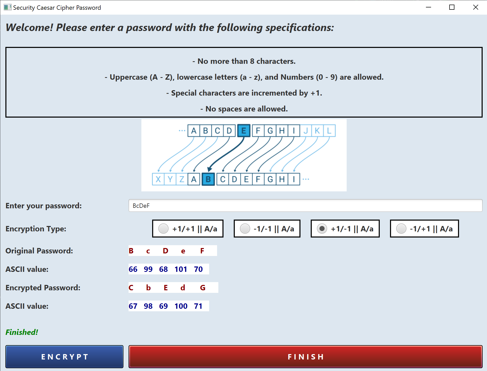

  In my first semester as a Grad student, everyone was assigned in groups of four to five to complete this project. We were provided a context prompt that involves a furniture store. The business would retain a database containing information on customers, products sold, shipping, employees, and delivery trucks. Before we could write any SQL Query, we were tasked to display our understanding of the logical workflows in the business process through various diagrams. This includes Entity Relationship Diagrams (ERD) and a Data Dictionary.

  I worked with everyone to discern which nouns from the provided prompt should be considered as Entities. This would identify what would be stored as tables and their corresponding attributes or traits for documentation purposes.

  From this project, I was given the opportunity to develop my management skills and coordinate with others to deliver the project ontime. In addition, I was able to employ the knowledge of writing SQL Query that I studied in-class throughout the semester to develop the Tables and their columns, insert the row data, and configure constraints that would help maintain consistency across our database.  
 
Source: <a href="https://github.com/"><i class="large github icon"></i>ChrisMakesKode</a>

