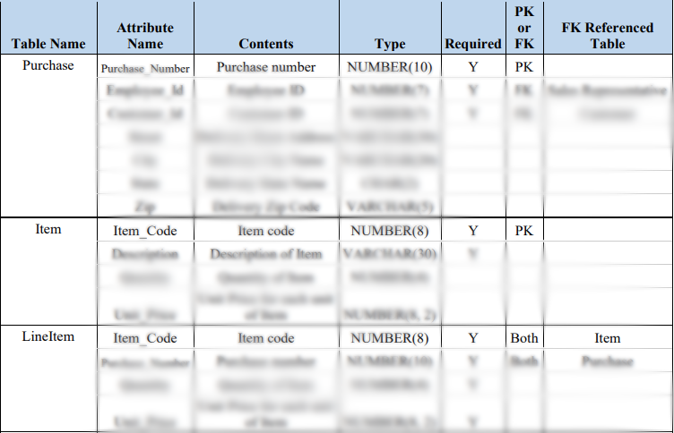
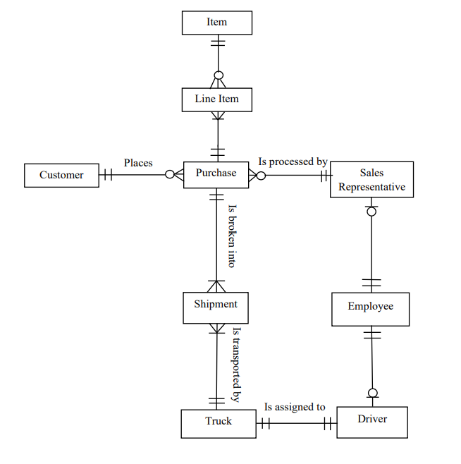

  
<figure>
    
    <figcaption style="vertical-align: middle;">Fig. 1. Sample of Data Dictionary  </figcaption>
  </figure>

  
  
     I lead this group project with the objective of developing and delivering a functional database for a furniture store. The database would retain accurate information on the store's customers, products sold, shipping, employees, and delivery trucks. Before I directed the group to write in SQL Query, sufficient understanding of the furniture outlet's business process and logical workflow were necessary. To achieve this, I guided the group in creating various diagrams which would detail how code would be written and data would be processed. Some of these diagrams include Entity Relationship Diagrams (ERD) and Data Dictionary.   

  
     I worked with everyone to discern which nouns from the provided prompt should be considered as Entities. This would identify what would be stored as tables and what their corresponding attributes or traits. Writing the SQL Queries to build the Database was one of the last parts. Our documented diagrams would facilitate group discussions on how we would proceed after finalizing our decisions.   

  
<figure>
    
    <figcaption style="vertical-align: middle;">Fig. 2. ERD  </figcaption>
  </figure>

  
     From this project, I was given the opportunity to develop my management skills and coordinate with others to deliver the project ontime. In addition, I was able to employ the knowledge of writing SQL Query that I studied in-class throughout the semester to develop the Tables and their columns, insert the row data, and configure constraints that would help maintain consistency across our database.               

