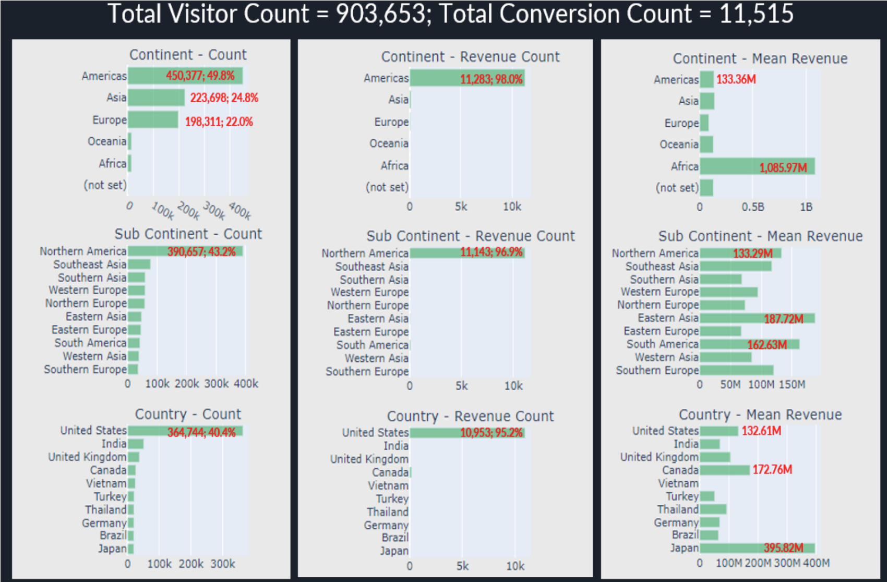

  
<figure>
    
    <figcaption style="vertical-align: middle;">Fig. 1. Sample of Data Dictionary  </figcaption>
  </figure>

  
  
     During Summer 2022, I was enrolled in the Web & Social Analytics class at University of Texas at Arlington. As a group of three, we analyzed visitor data from Google's online merchandise store for our major term project (Source: https://www.kaggle.com/competitions/ga-customer-revenue-prediction/overview). Together, we utilized data science techniques to recommend business insight that would support data driven decisions for Google's business.   

  
     First, the data needed to be preprocessed or cleaned for efficient analysis. Our team had applied JSON on the 12 initial columns to extract a total of 55 variables. Not every variable was particularly valuable or had meaningful data, so we dropped some variables. Our analysis only covered 36 variables: 35 independent and 1 dependent.   

  
<figure>
    
    <figcaption style="vertical-align: middle;">Fig. 2. High-Level Demographics  </figcaption>
  </figure>

  
     As displayed above in Fig. 2.1, we discovered that the majority of online visitors originated from the Americas (in both overall quantity and how many converted or contributed towards the Google Store's online revenue). However, the average revenue from conversions indicated that visitors from Africa were spending more than visitors from different continents. Our group recommended for the business analytics to look into this deeper, and investigate what could be done to replicate higher average revenue for other continents.              

