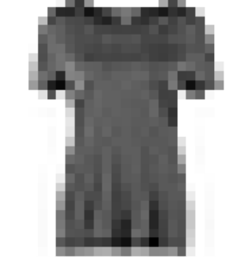
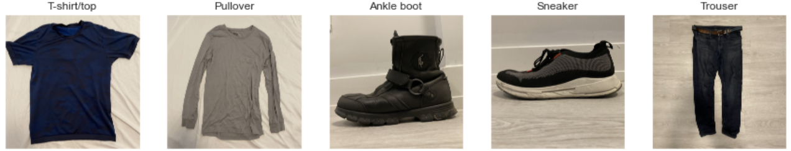

  
<figure>
    
    <figcaption style="vertical-align: middle;">Fig. 1. Sample of Data Dictionary  </figcaption>
  </figure>

  
  
     During Spring 2022, I took a course titled, "Data Science: A Programming Approach". I was already familiar with coding in Python, but I gained firsthand experience in employing that code for various machine learning algorithms. To challenge our knowledge, an individual project was assigned where I applied several supervised learning models torwards the MNIST Fashion Image dataset. The objective was to find the best predictive model that would accurately predict clothes based on their category. Once accomplished, I was expected to apply my selected best model with new out-of-sample data, or personal photos of my own clothes. The entire project and its documented findings was carried out in Jupyter Notebook.   
  
  <a href="../images/CK Image Fashion Recognizer.pdf" download>A copy of my report can be downloaded and read here. Click here.</a>

  
     In determining the optimal model, 4 categories were considered in my analysis: 
    - Wall (Clock) Time. The relative speed for a model to fit the data.  
    - Accuracy. This indicates how proficient a predictive model accurately predicts the out-of-sample data. 
    - Precision. Ratio of the true positives to the sum of true and false positives.  
    - Recall. Ratio of the true positives to the sum of the true positives and the false negatives.  
     
     Five models, or algorithms were considered: 
    - Linear Regression. 
    - K-Nearest Neighbor (KNN). 
    - Naive Bayes.  
    - Decision Tree.  
    - Random Forest.   
     Ultimately, I selected Decision Trees as my best model for its favorable overall efficiency and simplicity.  
  

  
<figure>
    
    <figcaption style="vertical-align: middle;">Fig. 2. Five Images of New Testing Data  </figcaption>
  </figure>

  
     With my selected model, it was time to apply it towards new data outside of the MNIST fashion dataset. I sampled some articles of clothes that I owned -- carefully positioning them to closely format them towards the other images in the MNIST dataset.              

