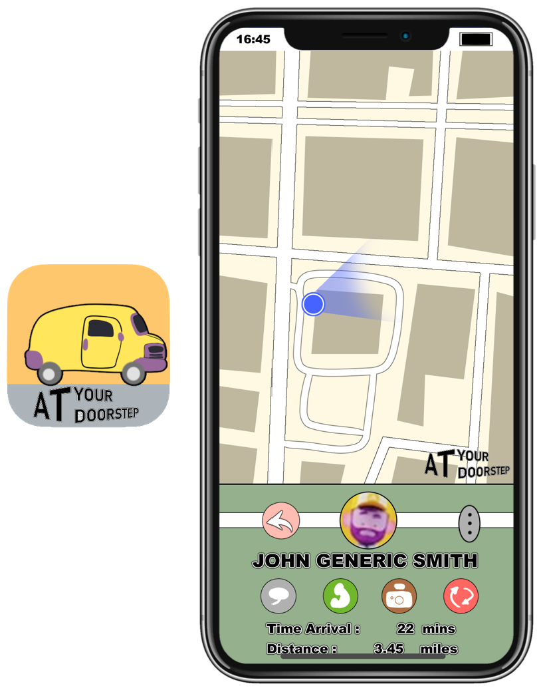
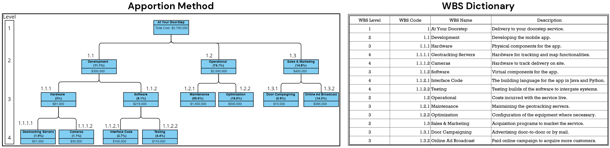
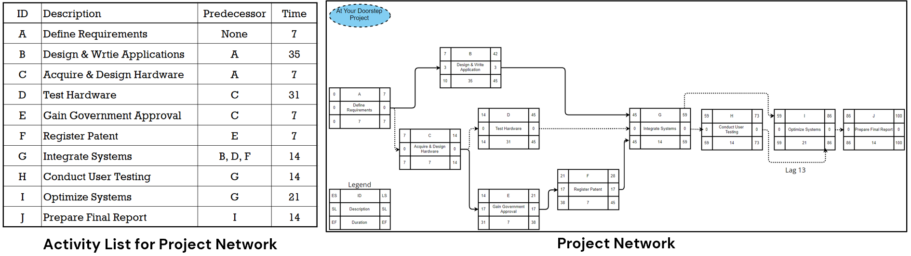

  
<figure>
    
    <figcaption style="vertical-align: middle;">Fig. 1. Image of app icon and interface  </figcaption>
  </figure>

  
  
     For a Project Management course in Fall 2022, I proficiently demonstrated Project Management concepts for a <i>hypothetical*</i> delivery service titled, <i><b>At Your Doorstep (AYD)</b></i>. Working on this project with 2 other people, it was my first exposure to project management software tools. Through this great opportunity, I was able to exercise my creativity in creating the necessary project diagrams that helped convey the needed information in the numerous presentations hosted by our professor.    
    *Had this delivery service aspect were actually real, <i><b>At Your Doorstep</b></i> would offer businesses to save overhead travel costs and efficient transportation services of goods from their app. For instance, say an executive has a major meeting in 30 minutes, but they realized they had forgotten an important printed report back at their residence. With insufficient time to make a round trip, the executive uses this service to request someone to enter their premises and transport their desired deliverable to their current office.  
  
  
<figure>
    
    <figcaption style="vertical-align: middle;">Fig. 2. Apportion Method and Work Breakdown Structure (WBS)  </figcaption>
  </figure>

    
     In Fig. 2 above, costs were broken down through the apportion method. From a management perspective, I pushed for the idea that our hypothetical personnel was assumed to possess sufficient expertise with the necessary geotracking technologies required for the delivery service. It was expected that these technologies would run high operating expenses, especially with continuous usage. For these reasons, it  appropriate to pursue the apportion method with WBS. 
  
  
  
<figure>
    
    <figcaption style="vertical-align: middle;">Fig. 3. Project Network  </figcaption>
  </figure>

    
     From early on, it was simulated that the project would be deployed in mid-December. Fig. 3. displays a project network diagram that illustrated the flow of subsequent activities that would lead towards the project's completion. In constructing these management tools, I strengthened my problem solving activities in considering how each necessary activity should be completed to fit the desired deadline. 
  

  
<figure>
    
    <figcaption style="vertical-align: middle;">Fig. 4. Gantt Chart  </figcaption>
  </figure>

  
     Given the sensitive nature of this project, the integrity and confidentiality of sensitive deliverables were considered. However, there was an issue with upper management in mid-November. They were reportedly not satisfied with the delivery software's current build at the time, and requested for a delay of at least four weeks for quality control -- effectively pushing the deployment date into 2023. However, our team argued that the marketing team's plans of marketing the delivery service already advertised the December release date. After much back-and-forth, our team was able to convince upper management that our prorgrammers were more than confident they could bring the quality of the project to speed. 

